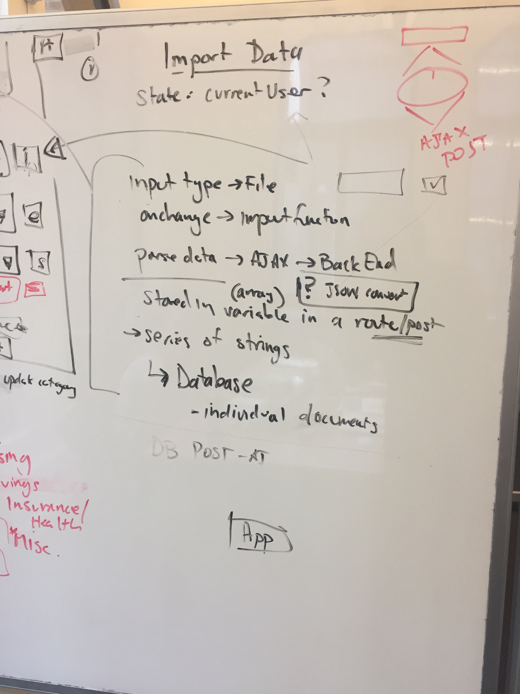
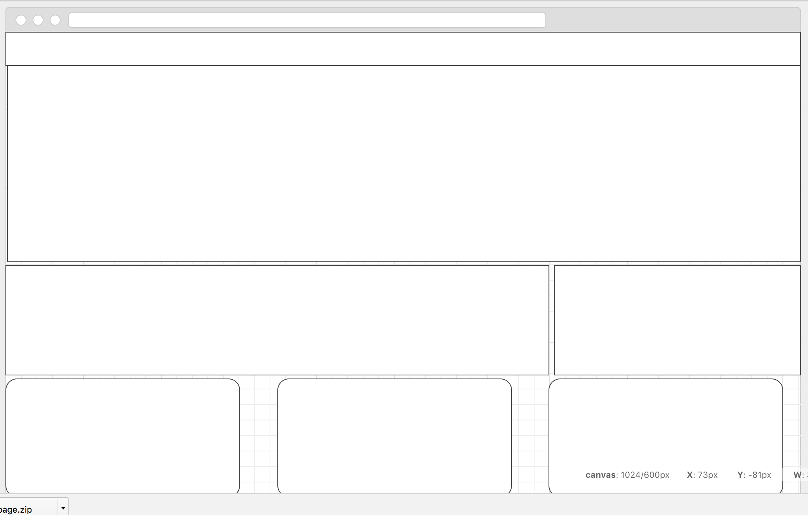
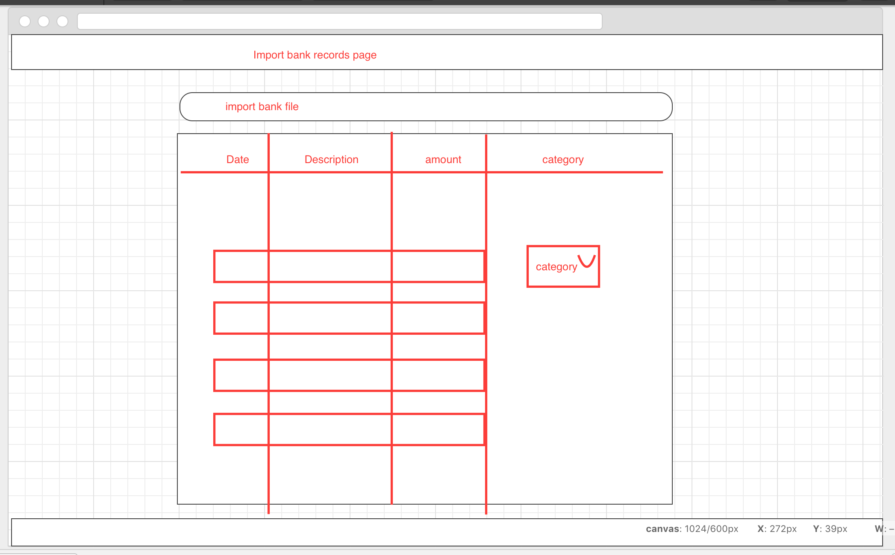
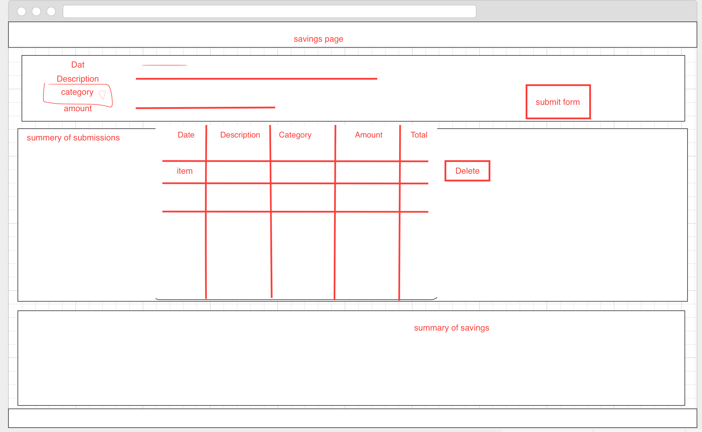
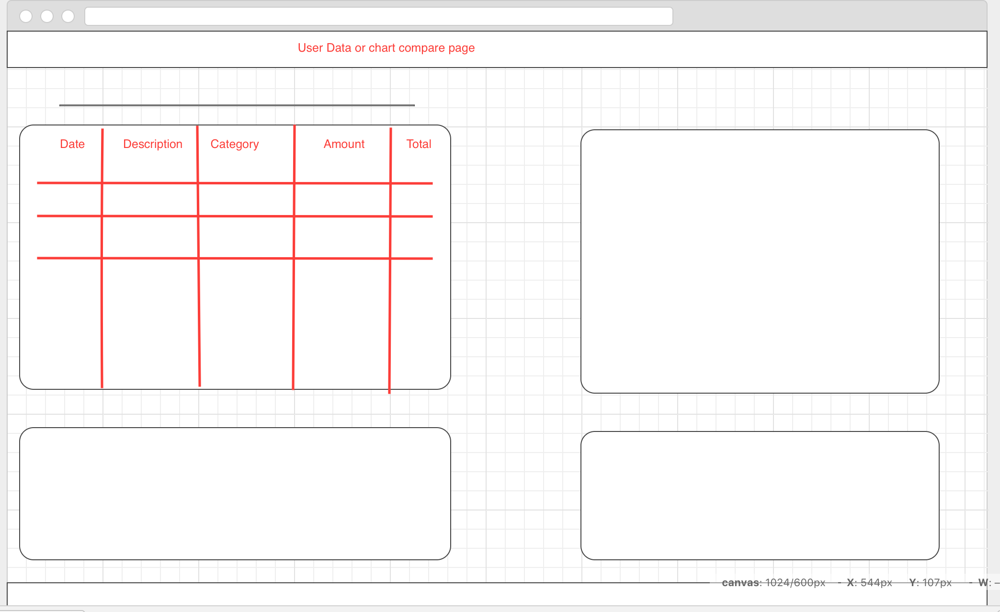
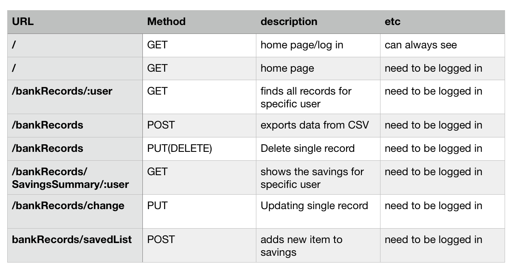

# Rainyday
### WDI project - best app to control your savings

# Technologies used #

* React
* HTML/JSX
* CSS
* Materialize
* JavaScript
* jQuery
* DOM
* JSON
* Fetch
* Axios
* Node.js
* npm
* RESTful
* mongoDB
* Auth

# Installation instructions #
* Run `npm install` to install dependencies
* Use `npm start` to start your application

* View this project on  <a href="#">Github</a>

# Approach taken: #

_Planning:_
## User Stories ##

* As a user, I want to categorize my expenses see how much I have spent on specific category
* As a user, I want to choose what expenses are redundant and choose not to spend money on those items anymore. 
* As a user, I want to track my savings and see the difference in my budget before and after I have implemented them.

_Pseudo coding:_

_initial planning:_

_wireframes:_

_planing the flow of the app:_

_planing the routes:_

_Execution:_ 

1.  We have planned carrefully every page of the app, decided what we would like as a user to see.   

2.  Each of us have worked on different feature of the app, while collaborated with each other.  

3.  We made the routes  and created the front-end pages with React.

4.    

5.  Designed with Materilize    

6.  Github mutual contribution    

# Unsolved problems #
_Things we would love to accomplish later:_
* 
* 
* 

